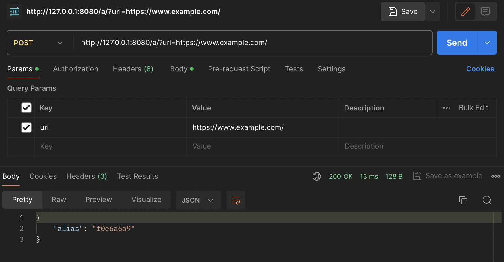
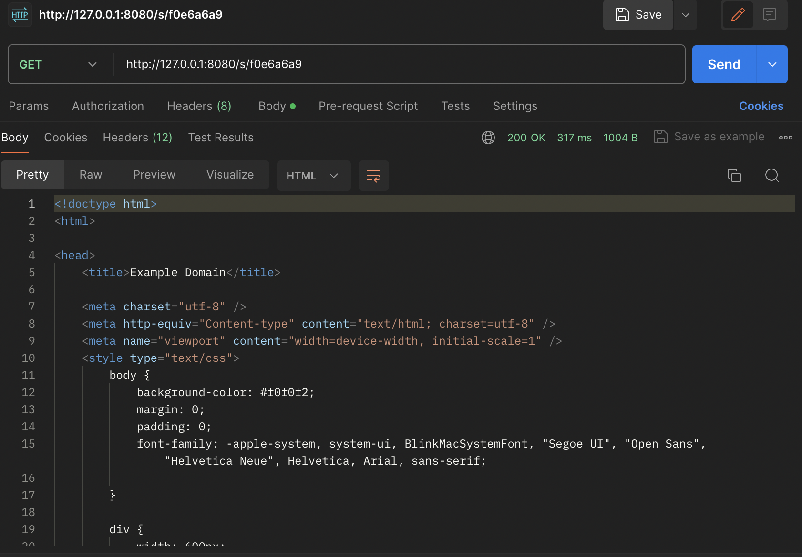
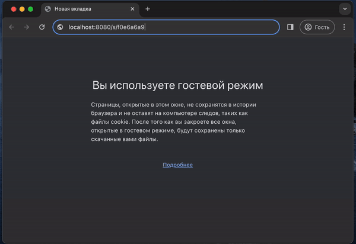

# urlShortener
This project is a URL shortening service enabling to shorten long URLs into 
eight-character codes - short URLs that redirect to original, longer ones.

### Technologies and Frameworks
The project uses the following technologies and frameworks:

- Go programming language
- Fiber framework for building HTTP APIs
- Zap Logger for logging
- Redis for caching
- PostgreSQL for database storage
- Docker for containerization

### Installation and Running

```
make run
```
This command will start the containers and configure the necessary services.

### API Endpoints
The application provides the following API endpoints:

1. URL Addition Endpoint (/a/):
- Endpoint: `http://127.0.0.1:8080/a/?url=`
- Description: Allows users to add a URL for shortening. Users submit a long URL through this endpoint, and the service generates a unique eight-character code for it. If the same URL is added again, the service returns the same code.
- Method: POST
- Parameters:
- - url: The long URL to be shortened.
- Response:
- - Status Code: 200
- - Body: Eight-character code (/^[A-z0-9]{8}$/) representing the shortened URL.



2. Redirection Endpoint (/s/`<code>`):
- Endpoint: `http://127.0.0.1:8080/s/<code>`
- Description: Redirects users to the original long URL associated with the provided eight-character code. Accessing this endpoint triggers a 302 redirect to the original URL.
- Method: GET
- Parameters:
- - `<code>`: The eight-character code representing the shortened URL.
- Response:
- - Status Code: 302 (Redirect)
- - Redirects the user to the original long URL.




